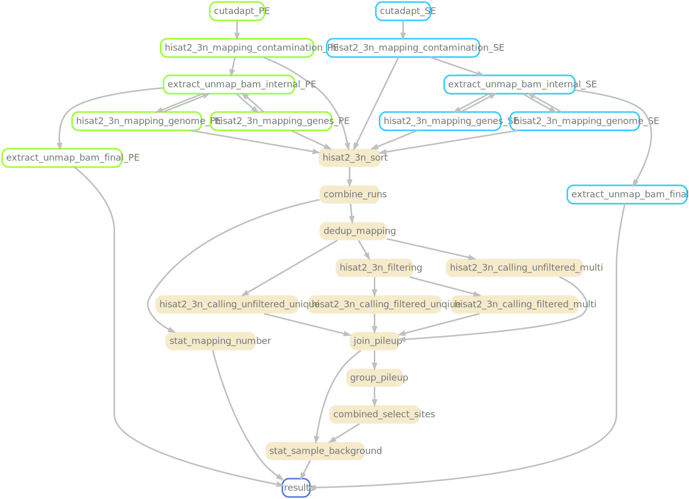

[](https://doi.org/10.5281/zenodo.11046885)

# DEV by Shuhuai Li

> [!important]
> This branch just store the necessary scripts to optimize the workflow. There is modification on codes in other repos, like [hisat-3n](https://github.com/ASC25-SHU02/hisat2/tree/lsh_op/noThread)
> It is still under development. But pass the necessary tests.

Now, I focus on the `hisat-3n` tool. You can check my modification on codes [here](https://github.com/ASC25-SHU02/hisat2). 

I name my work after branch name `lsh_op/XXX`, where XXX explains what aspect I try to optimize in this branch, while op stands for optimization (genshin impact).

Now, the **sota** is on `lsh_op/noThread`.

## My result
> detailed log is in `log/stage1_SRR23538290.sh.log`
- time spent in `stage1`: `Total execution time: 2329 seconds`
- Precision and correlation:
  ```
  =====Precision=====
  97.47%
  ===================
  =====Correlation=====
  0.997648
  =====================
  ```
## Reproduce
1. Configure and run the basic workflow under branch `config`
2. Checkout to this branch, and run the scripts under directory `script`
    - any script named after `stage1_XXX` is enough to witness the optimization
    - you can run the whole workflow with the same procedure as described in `config`
3. Check the result by running the script called `check.sh` under dir `./check`
    - you can only check your result if you finish the whole workflow

## TODO
1. Overall workflow optimization:
    - four hotspot commands run in parallel
    - substitue `unix pipe` for temporary files

---
# Origin stuff (Not changed)

# m<sup>5</sup>C-UBSseq

## Changelog

- 4/23/2024: rewrite code using polars

## workflow

[](https://github.com/y9c/m5C-UBSseq)

## Citation

- cite this software

  ```BibTex
  @software{chang_y_2024_11046885,
      author    = {Chang Y},
      title     = {y9c/m5C-UBSseq: V0.1},
      publisher = {Zenodo},
      version   = {v0.1},
      doi       = {10.5281/zenodo.11046885},
      url       = {https://doi.org/10.5281/zenodo.11046885}
  }
  ```

- cite the method

  ```BibTex
  @article{dai_ultrafast_2024,
      title = {Ultrafast bisulfite sequencing detection of 5-methylcytosine in {DNA} and {RNA}},
      url = {https://www.nature.com/articles/s41587-023-02034-w},
      doi = {10.1038/s41587-023-02034-w},
      author = {Dai, Qing and Ye, Chang and Irkliyenko, Iryna and Wang, Yiding and Sun, Hui-Lung and Gao, Yun and Liu, Yushuai and Beadell, Alana and Perea, José and Goel, Ajay and He, Chuan},
      date = {2024-01-02},
  }
  ```

&nbsp;

<p align="center">

</p>
<p align="center">
Copyright &copy; 2021-present
<a href="https://github.com/y9c" target="_blank">Chang Y</a>
</p>
<p align="center">
